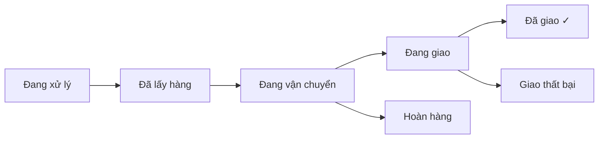

# Hướng dẫn Quản lý Vận chuyển

> Tài liệu hướng dẫn sử dụng module Vận chuyển trong hệ thống Admin StyleZone.

---

## 1. Tổng quan quy trình

| Trạng thái | Mô tả |
|---|---|
| **Đang xử lý** | Vận đơn vừa tạo, chờ đơn vị vận chuyển lấy hàng |
| **Đã lấy hàng** | Shipper đã đến lấy hàng từ kho |
| **Đang vận chuyển** | Hàng đang trên đường đến bưu cục phát |
| **Đang giao** | Shipper đang giao đến người nhận |
| **Đã giao** | Giao thành công → tự động cập nhật đơn hàng |
| **Hoàn hàng** | Hàng bị trả về kho |
| **Giao thất bại** | Không giao được (sai địa chỉ, khách từ chối...) |

---

## 2. Dashboard Pipeline

Thanh Kanban phía trên hiển thị số lượng vận đơn ở mỗi trạng thái.

- **Nhấn vào stage** bất kỳ → lọc bảng theo trạng thái đó
- Mũi tên thể hiện thứ tự quy trình

---

## 3. Tạo vận đơn

### 3.1 Tạo thủ công
1. Nhấn **"Tạo vận đơn"** → **"Tạo thủ công"**
2. Nhập: Mã vận đơn, mã đơn hàng (tùy chọn), đơn vị VC, thông tin người nhận
3. Nhấn **"Tạo vận đơn"** để hoàn tất

### 3.2 Tạo từ đơn hàng
1. Nhấn **"Tạo vận đơn"** → **"Tạo từ đơn hàng"**
2. Chọn đơn vị vận chuyển (GHN, GHTK, Viettel Post, J&T, Ninja Van)
3. Nhấn vào đơn hàng muốn tạo vận đơn (chỉ hiện đơn "Đã xác nhận" / "Chờ xử lý" chưa có vận đơn)
4. Hệ thống tự điền: tên, SĐT, địa chỉ, mã đơn hàng. Mã vận đơn tự sinh.

---

## 4. Cập nhật trạng thái

1. Nhấn **⋮** (ba chấm) → **"Cập nhật trạng thái"** hoặc vào chi tiết → **"Cập nhật"**
2. Nhập **vị trí hiện tại** (VD: Kho HCM, Bưu cục Q1)
3. Nhập **ghi chú** (VD: Đã giao cho shipper, Khách không nhận)
4. Chọn trạng thái mới

> **Lưu ý**: Khi chuyển sang "Đã giao", hệ thống tự đồng bộ trạng thái đơn hàng thành "Đã giao".

---

## 5. Cập nhật hàng loạt

1. Tick checkbox ở các vận đơn muốn cập nhật
2. Thanh công cụ xuất hiện với các trạng thái có thể chuyển
3. Nhấn trạng thái → tất cả vận đơn đã chọn cùng chuyển

---

## 6. Bộ lọc & Tìm kiếm

| Bộ lọc | Mô tả |
|---|---|
| **Tìm kiếm** | Theo mã vận đơn, mã đơn hàng, SĐT, tên người nhận |
| **Đơn vị VC** | GHN, GHTK, Viettel Post, J&T Express, Ninja Van |
| **Thời gian** | Hôm nay, 7 ngày, 30 ngày, Tháng này |
| **Tab trạng thái** | Lọc theo 7 nhóm trạng thái |
| **Reset** | Xóa tất cả bộ lọc |

---

## 7. Chi tiết vận đơn

- **Timeline** — Hiển thị toàn bộ lịch sử: trạng thái, vị trí, ghi chú, thời gian
- **Người nhận** — Tên, SĐT, địa chỉ
- **Thông tin vận đơn** — Đơn vị VC, ngày gửi/dự kiến/giao, mã đơn hàng
- **Đơn hàng gốc** (nếu có) — Mã đơn, tổng tiền, phương thức thanh toán, danh sách sản phẩm

---

## 8. Xuất CSV

1. Nhấn **"Xuất CSV"** ở góc trên
2. Cửa sổ hiện nội dung CSV
3. Sao chép và dán vào file `.csv` để mở bằng Excel

**Các cột xuất**: Mã vận đơn, Đơn hàng, Đơn vị VC, Người nhận, SĐT, Địa chỉ, Trạng thái, Ngày tạo, Dự kiến giao, Ngày giao

---

## 9. KPI Cards

| Chỉ số | Ý nghĩa |
|---|---|
| **Đang vận chuyển** | Số vận đơn đang trên đường (vận chuyển + đang giao) |
| **Giao hôm nay** | Số vận đơn giao thành công trong ngày |
| **Tạo hôm nay** | Số vận đơn mới tạo trong ngày |
| **Trễ hạn** | Vận đơn quá ngày dự kiến mà chưa giao |
| **Hoàn / Thất bại** | Tổng vận đơn hoàn + giao thất bại |
| **Tỉ lệ thành công** | % giao thành công trên tổng đã hoàn tất |

---

## 10. Xử lý sự cố

| Vấn đề | Giải pháp |
|---|---|
| Không thấy đơn hàng khi tạo từ ĐH | Đảm bảo đơn ở trạng thái "Đã xác nhận" hoặc "Chờ xử lý" và chưa có vận đơn |
| Trạng thái đơn hàng không tự cập nhật | Chỉ cập nhật khi vận đơn chuyển sang "Đã giao" |
| Vận đơn hiện cảnh báo "TRỄ HẠN" | Ngày hiện tại đã qua ngày dự kiến giao. Cần xử lý ngay |
